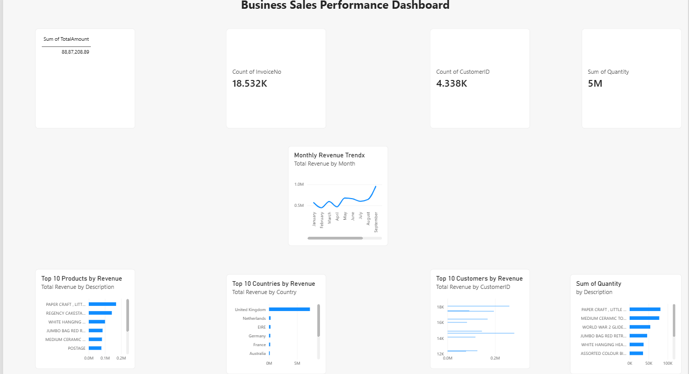

# E-Commerce Customer & Sales Analytics

## Project Overview

This project analyzes e-commerce customer and sales data to identify revenue trends, customer purchasing behavior, product performance, and valuable customer segments.

The project uses Python, SQL Server, and data analytics techniques to transform raw transaction data into meaningful business insights.

## Objectives

- Analyze overall sales and revenue performance
- Identify top-performing products and countries
- Understand customer purchasing behavior
- Compare one-time and repeat customers
- Perform RFM customer segmentation
- Identify high-value and at-risk customers
- Generate actionable business recommendations

## Tools & Technologies

- Python
- Pandas
- NumPy
- Matplotlib
- Seaborn
- SQL Server
- SQL Server Management Studio
- Power BI

## Dataset

The project uses the Online Retail dataset containing e-commerce transactions such as:

- Invoice Number
- Stock Code
- Product Description
- Quantity
- Invoice Date
- Unit Price
- Customer ID
- Country

## Data Cleaning

The following cleaning steps were performed:

- Removed duplicate records
- Removed records with missing Customer IDs
- Converted InvoiceDate to datetime format
- Removed transactions with invalid quantities
- Removed transactions with invalid unit prices
- Created a TotalAmount column

After cleaning, the dataset contained 392,692 records.

## Exploratory Data Analysis

The analysis covered:

- Total revenue
- Total quantity sold
- Number of customers
- Number of products
- Monthly revenue trends
- Average Order Value
- Top products by revenue
- Top countries by revenue
- Top customers by revenue
- Customer order frequency
- One-time vs repeat customers
- Product quantity analysis

## RFM Customer Segmentation

Customers were segmented using:

- Recency
- Frequency
- Monetary Value

The resulting customer segments include:

- Champions
- Loyal Customers
- Potential Customers
- At Risk
- Lost Customers

## SQL Analysis

SQL Server was used to perform business analysis including:

- Revenue analysis
- Product performance
- Country performance
- Monthly sales trends
- Customer analysis
- Average Order Value
- Customer purchasing frequency

## Key Business Recommendations

1. Encourage one-time customers to make repeat purchases through targeted offers.
2. Retain high-value customers using loyalty rewards and personalized promotions.
3. Re-engage at-risk customers through win-back campaigns.
4. Maintain sufficient inventory for high-performing products.
5. Focus on strong markets while identifying opportunities in other countries.
6. Use sales trends to improve inventory and marketing planning.

## Project Outcome

The project demonstrates an end-to-end data analytics workflow, from data cleaning and exploratory analysis to SQL analysis, customer segmentation, and business recommendations
## Power BI Dashboard

The project includes an interactive Power BI dashboard covering:

- Monthly Revenue Trends
- Top 10 Products by Revenue
- Top 10 Countries by Revenue
- Top 10 Customers by Revenue
- Top 10 Products by Quantity
- Business Insights and Recommendations

### Dashboard Preview

